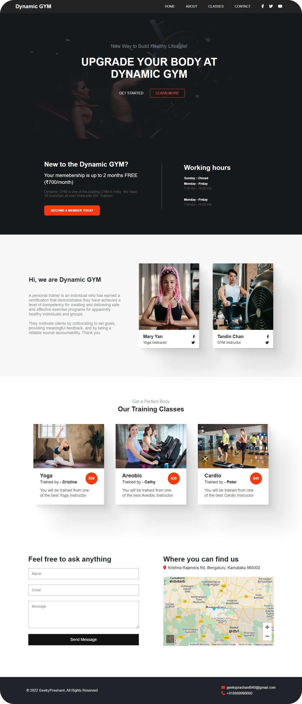

  
  
  
  
 
   

  <h2 align="center">Responsive GYM Website</h2>

  In this project, I have created Responsive GYM Website, The project is built using HTML, CSS & JavaScript.

  <a href="https://resilient-chaja-e4508a.netlify.app/"><strong>➥ Live Demo</strong></a>

### Demo Screeshots

